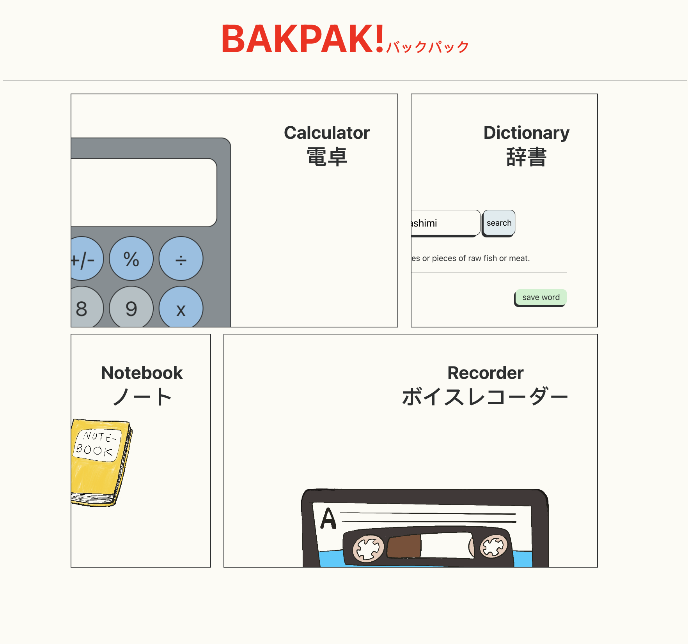

# BakPak!
A ReactJS application that offers a variety of practical tools for school, work, and research. BakPak is an exercise in exploring indexedDB, localStorage, various API libraries, and playing with style and building things from scratch with JavaScript.  

## Live Link
https://archonology.github.io/BakPak/#/home

## Screenshot

## Questions
If you have questions please contact any of the developers listed: Reed Meher / reed@meherdevs.com
Check out more of our work on Github at [archonology](https://github.com/archonology).
